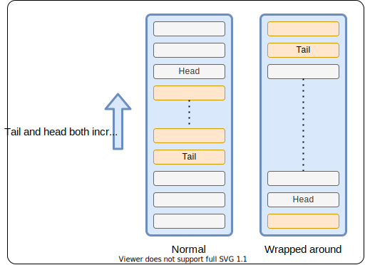
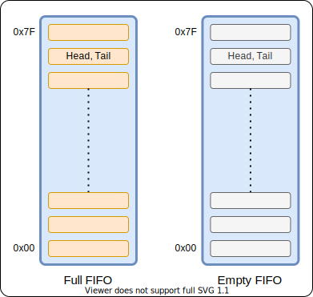
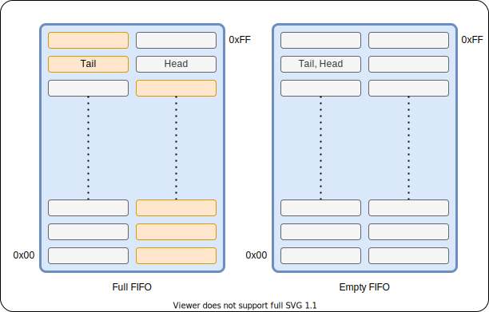
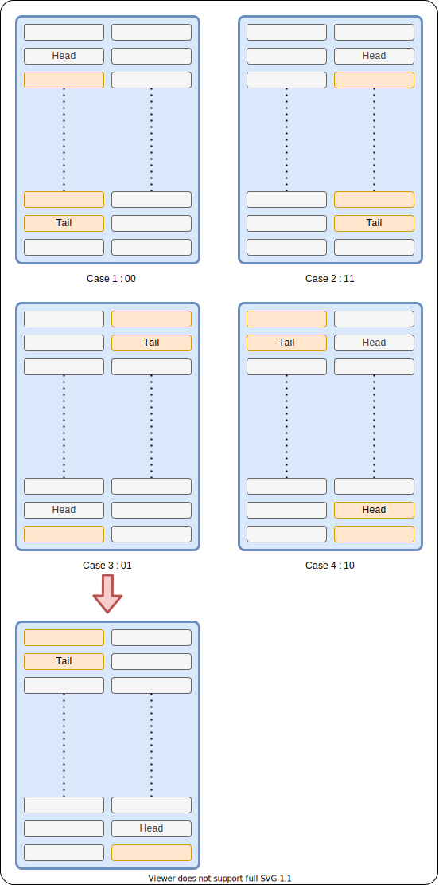

# Simple FIFO

- A simple synchronous FIFO

### Parameters
  - ```p_WORD_LEN```
    - Size of each entry
    - Default = 8
  - ```p_FIFO_SIZE``` 
    - Size of FIFO memory
    - Default= 8

### Ports

| Name              | Description |
|---                |---|
| ```i_clk```       | All operations are synchronized on posedge |
| ```o_reset```     | Synchronous reset|
| ```o_full```      | Is FIFO full? | 
| ```o_empty```     | Is FIFO empty? |
| ```o_len```       | Number of elements in the FIFO |
| ```i_enq_data```  | Data to push to FIFO |
| ```i_enq_en```    | Push to FIFO |
| ```o_enq_rdy```   | Can i push to FIFO? (same as !o_full) |
| ```o_out_data```  | Data in current tail. Is ```0xFF``` if FIFO is empty |
| ```i_deq_en```    | Pop from FIFO |
| ```o_deq_rdy```   | Can i pop from FIFO? (same as !o_empty) |

- On performing a dequeue, ```o_out_data``` changes to next tail. So, to get value that was dequeued, we need to latch the value outside before the dequeue operation.
- ```deq_rdy``` being low indicates that o_out_data is invalid (all entries were popped)

### Waveform


---

## Implementation

This is how our FIFO looks like. We store the address of head and tail. Head is invalid. We follow a write-and-increment policy for the head.



One problem with this is that we cannot disinguish between an empty and ful case with just the address.



So, we have a virtual address with one more bit which acts like a flag to distinguish between the two. We still increment both tail and head like normal but index using only the lower order bits of this address. In the figure below, the two cells kept side-by-side both map to the same memory address, but have different MSB.



Using this virtual address, we can see it is full or empty. It is full if lower order bits are the same, but MSB is different for head and tail. It is empty if head and tail have exactly the same address including MSB.

However, calculating length can be a bit tricky. We handle this as 4 cases. Only when the head has MSB 0 and tail has MSB 1, will there be a need for a special case. For all other cases, we simply subttract tail from head (including the flag bit). For the special case, we flip the flag bits of both the head and tail and do the same operation.



## Synthesis

Synthesis was tested using Xilinx vivado. Block RAMs were inferred.
