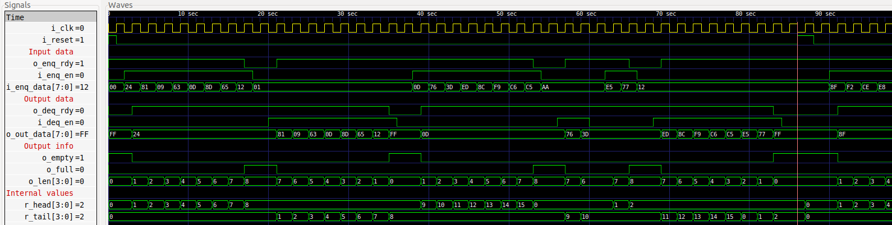

# FIFO

- A synchronous FIFO
- Parameters
  - ```p_WORD_LEN```
    - Size of each entry
    - Default = 8
  - ```p_FIFO_SIZE``` 
    - Size of FIFO memory
    - Default= 8
- Ports

| Name              | Description |
|---                |---|
| ```i_clk```       | All operations are synchronized on posedge |
| ```o_reset```     | Synchronous reset|
| ```o_full```      | Is FIFO full? | 
| ```o_empty```     | Is FIFO empty? |
| ```i_enq_data```  | Data to push to FIFO |
| ```i_enq_en```    | Push to FIFO |
| ```o_enq_rdy```   | Can i push to FIFO? (same as !o_full) |
| ```o_out_data```  | Data in current tail. Is ```0xFF``` if FIFO is empty |
| ```i_deq_en```    | Pop from FIFO |
| ```o_deq_rdy```   | Can i pop from FIFO? (same as !o_empty) |

- On performing a dequeue, ```o_out_data``` changes to next tail. So, to get value that was dequeued, we need to latch the value outside before the dequeue operation.
- ```deq_rdy``` being low indicates that o_out_data is invalid (all entries were popped)

## Waveform


