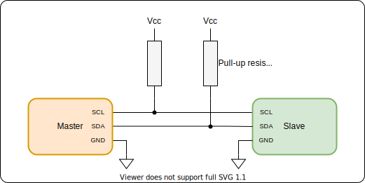
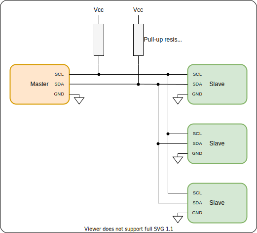
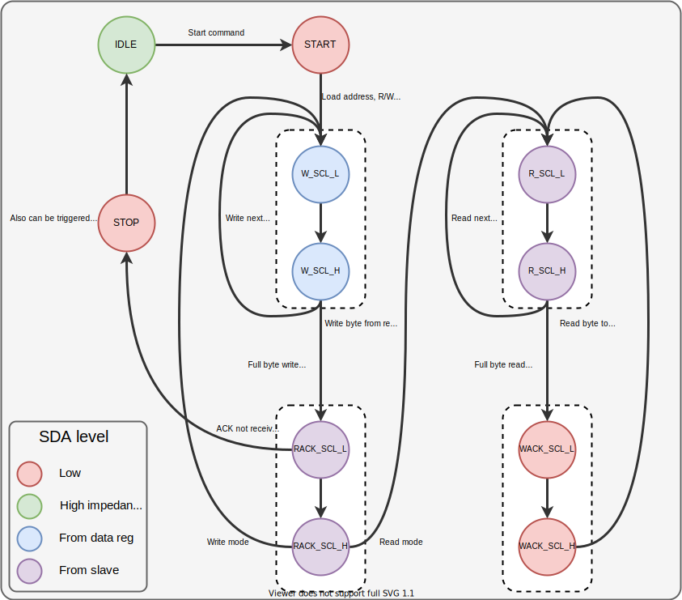

# I2C

## Specification

- Two lines, SDA and SCL
- ```SDA``` : Data
- ```SCL``` : Clock
- Signals are sampled on positive edge of SCL, and change on its negative edge

#### Single master and single slave:


```Master``` : Controls the clock signal and initiates all transactions
```Slave``` : Just responds to the master

#### Multiple slaves


- An address is used to index each slave.

#### Waveform


- ```START``` : SDL h->l when SCL is high
- ```STOP``` : SDL l->h when SCL is high

- ```Address``` : 7 bits
- ```R/W``` bit : HIGH => Read, LOW => Write
- ```ACK``` : Whoever receives the data pulls SDA low. If the byte was sent by master, slave send ```ACK```. Else, master sends ```ACK```.
- ```Data``` : 8 bits
- All addresses and data bytes are send MSB first

---

# Master core

## FSM
- The core of the I2C IP works using a finite state machine. This is its state transition diagram. It is a moore machine (almost). SDA and SCL depends on the state it is in, but SDA can also be dependent on address/data that is being sent.



There are 2 tracks, one for sending and one fore receiving. There is a bit counter which counts from 0 to 7. For writing, we load the value to the data register from the input port and then move to W_SCL_L (Write, SCL Low state) state. The MSB bit is output on the SDA line. Then it moves to W_SCL_H. The l->h SCL transition means that the bit was written to slave. Then it increments bit counter and moves to W_SCL_L to transmit the next bit. This continues till counter becomes > 7.

After counter completes, it goes to ACK states, where it listens for an ACK from the slave. If no ACK is received, it goes to stop condition and sends a stop signal.

Reading is similar to writing, but we read the bit from SDA in R_SCL_H state and write it to the register.

For the initial address/RW bit, we load the required byte to the register and start the write sequence. Then, depending on if the operation was a read or write, after the ACK, the read or write sequence is started again.

---

## References

- https://i2c.info/i2c-bus-specification
- Official I2C documentation by NXP : https://www.nxp.com/docs/en/application-note/AN10216.pdf
- I2C state machine architecture : http://www.cs.columbia.edu/~cs4823/handouts/proj1-i2c-problem.pdf
- 
