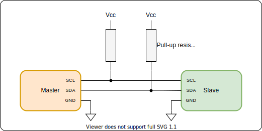
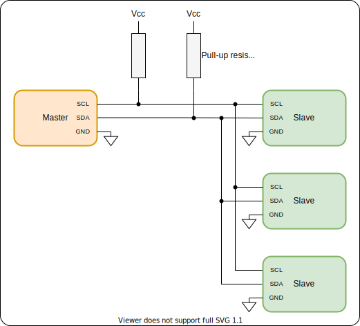
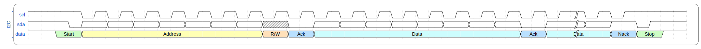
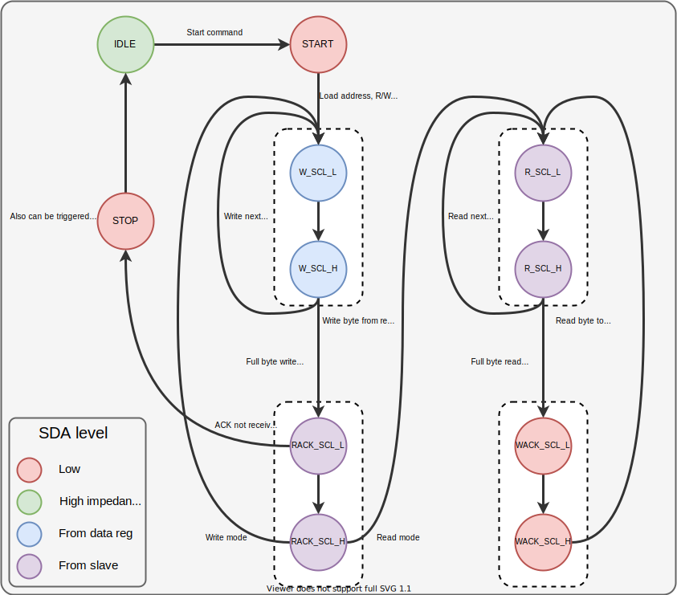

# I2C

## Specification

- Two lines, SDA and SCL
- ```SDA``` : Data
- ```SCL``` : Clock
- Signals are sampled on positive edge of SCL, and change on its negative edge
- A wired-AND connection is used on the pins. An external pullup resistor is used for this. All masters and slaves output a high impedance state for output ```1``` and pull the pin to ground for output ```0```. The end result is that if any of the outputs pull the pin to ```0```, the whole line becomes ```0```, acting like and ```AND``` gate.
- Multiple masters and multiple slaves can exist on the bus
- Slaves can slow down the clock by keeping it low even when master releases it to high. Called "clock stretching"
- Multiple masters need to arbitrate control over the bus

#### Single master and single slave:


```Master``` : Controls the clock signal and initiates all transactions
```Slave``` : Just responds to the master

#### Multiple slaves


- An address is used to index each slave.

#### Waveform


- ```START``` : SDL h->l when SCL is high
- ```STOP``` : SDL l->h when SCL is high

- ```Address``` : 7 bits
- ```R/W``` bit : HIGH => Read, LOW => Write
- ```ACK``` : Whoever receives the data pulls SDA low. If the byte was sent by master, slave send ```ACK```. Else, master sends ```ACK```.
- ```Data``` : 8 bits
- All addresses and data bytes are send MSB first

---

# Master core

## Finite state machine

- The core of the I2C IP works using a finite state machine. This is its state transition diagram. It is a moore machine (almost). SCL depends on the state of the FSM, but SDA can also be dependent on address/data that is being sent 
- Here, SDA dependent on data register is represented by an ```x```). 
- Sometimes SDA level depends on another device on the bus. This is represented by a ```z```

States

| Name            | Number | Description | SDA | SCL |
|-----------------|--------|-------------|-----|-----|
| s_IDLE          | 0      | Bus idle    | 1   | 1   |
| s_START         | 1      | Start bit   | 0   | 1   |
| s_W_SCL_HIGH    | 2      | Write bit   | x   | 1   |
| s_W_SCL_LOW     | 3      | Write bit   | x   | 0   |
| s_RACK_SCL_LOW  | 4      | Read ack    | z   | 0   |
| s_RACK_SCL_HIGH | 5      | Read ack    | z   | 1   |
| s_R_SCL_HIGH    | 6      | Read bit    | z   | 1   |
| s_R_SCL_LOW     | 7      | Read bit    | z   | 0   |
| s_WACK_SCL_LOW  | 8      | Write ack   | 0   | 0   |
| s_WACK_SCL_HIGH | 9      | Write ack   | 0   | 1   |
| s_STOP          | 10     | Stop bit    | 0   | 1   |
| s_DISABLED      | 11     | Another master | z| z   |

- Start condition is on transition from ```s_IDLE``` to ```s_START```
- Stop condition is on transition from ```s_STOP``` to ```s_IDLE```



- There are 2 tracks, one for sending and one for receiving. 
- There is a bit counter which counts from 0 to 7. 
- For writing, 
  1) We load the value to the data register from the input port
  2) Move to ```W_SCL_L``` (Write, ```SCL``` Low state) state. The MSB bit is output on the ```SDA``` line. 
  3) Then on next state command, it moves to ```W_SCL_H```. The l->h ```SCL``` transition means that the bit was written to slave.
  4) On another next state command, it increments bit counter and moves to ```W_SCL_L``` to transmit the next bit.
  5) This continues till counter becomes > 7. At that stage, it moves to the ```RACK_SCL_L``` (Read acknowledge, ```SCL``` low) state where it listens for an ```ACK``` from the slave
  6) On next_state command, it moves to ```RACK_SCL_H``` and checks if ```SDA``` is low. If it is, acknowledge was received. Else, ACK was unsuccessfull. So, it outputs the signal, ```o_ackerror``` and moves to the ```STOP``` state next
  7) On ```next_state``` command, it transitions to ```R_SCL_L``` if it is in read mode or to ```W_SCL_L``` if it is in write mode

- To send the address, R/W bit, after the start state, we load the address and R/W bit onto the data register and put the FSM into the write track. We also set the ```r_rw``` register that will determine if the master sends or receives after the first byte.

- Transitions from ```IDLE``` -> ```START```, ```RACK_SCL_H``` -> ```STOP``` (on no ACK received) and from any state to ```STOP``` are asynchronous with respect to ```i_next_state```. They can happen on an internal clock cycle.

Reading is similar to writing, but we read the bit from ```SDA``` in ```R_SCL_H``` state and write it to the register.

For the initial address/RW bit, we load the required byte to the register and start the write sequence. Then, depending on if the operation was a read or write, after the ```ACK```, the read or write sequence is started again.

#### Clock stretching

For clock stretching, when SCL is high (in states ```s_W_SCL_HIGH```, ```s_R_SCL_HIGH```, ```s_RACK_SCL_HIGH```, ```s_WACK_SCL_HIGH```, ```s_STOP```), a check is made if SCL line is high or low. If it is low it means the slave is stretching the clock. So, we output a signal, ```o_clkstretched``` to indicate this and disable next state transition. As soon as the slave releases the clock, SCL goes high and ```o_clkstretched``` becomes 0 and we can transition to the next state.

#### Arbitration

For other masters initiating transfers when our master is ```IDLE```
- We have a ```DISABLED``` state
- In ```IDLE``` state, look out for a ```START``` condition (```SCL``` high, ```SDA``` low). If you get it, move to ```DISABLED ```state
- In ```DISABLED``` state, look out for ```STOP``` condition on the bus. If found, transition to ```START``` condition

For other masters initiating transfers at same time we give a ```START```
- We need to check on every output if actual output is what we expect.
- On ```W_SCL_HIGH```, check if output is actually what we drive on the ```SDA``` line. If it not (we give a 1 and see 0), it means another master is sending a 0. Transition to the ```DISABLED``` state. So, the master addressing the smaller address wins.

---

## References

- https://i2c.info/i2c-bus-specification
- Official I2C documentation by NXP : https://www.generationrobots.com/media/Capteur-MinIMU-9-v3/bus-I2C-UM10204-specification-user-manual.pdf
- I2C state machine architecture : http://www.cs.columbia.edu/~cs4823/handouts/proj1-i2c-problem.pdf
