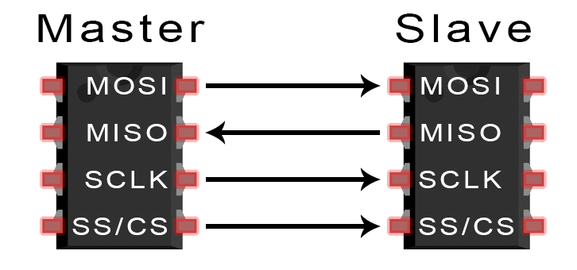
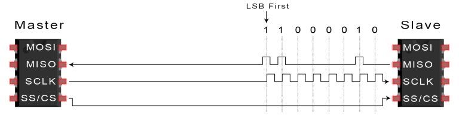
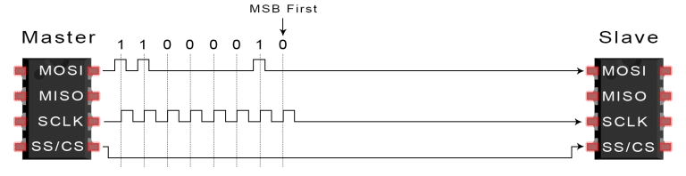
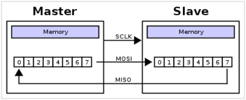
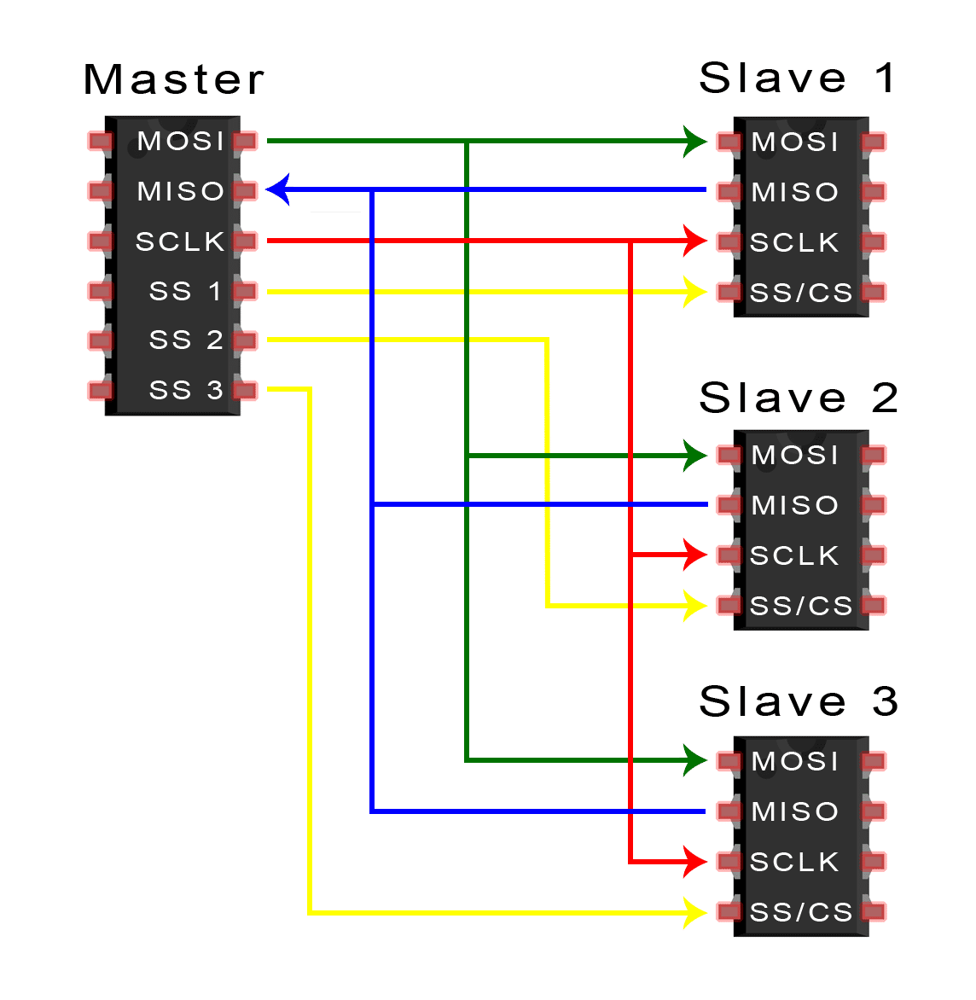
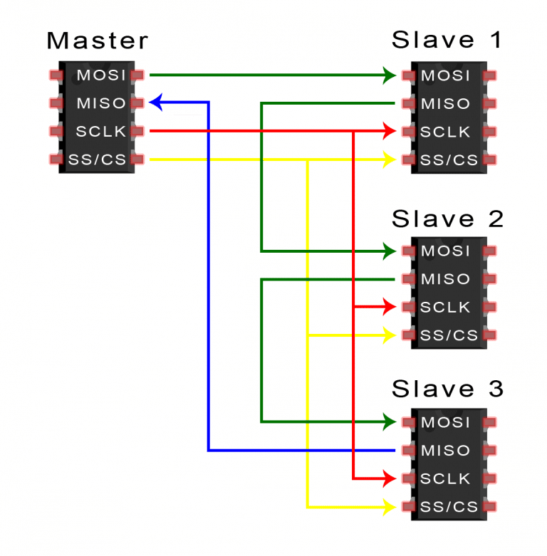

# SPI Protocol

# Features

- Synchronous
- Serial
- Full duplex
- Master-slave architecture
- Single master multiple slave

# Popular uses
- For interfacing microcontrollers with sensors or other modules (SD cards, EEPROMs, etc)

# Interface



- One clock pin
  - ```SCLK```    : Sent by master to slaves
    - Data is sample on the rising edge of clock
- 2 data pins
  - ```MOSI```    : Master Out Slave In
    - MSB first
  - ```MISO```    : Master In Slave Out
    - LSB first
- Select pins for each slave
  - ```SS```      : Slave select (Active ```LOW```)
- Any number of bits can be sent or received - no concept of packets

Often, peripheral devices call MOSI as SDI (Serial Data In) and MISO as SDO (Serial Data Out), and Slave select as CS (Chip Select)

# Protocol

Master In Slave Out


Master Out Slave In


Both of these can happen simultaneously. 

The SPI protocol is implemented using shift registers.



So, the SPI protocol acts like a ring buffer in this case. The slave buffer is read by the controller when CS pin goes high.

# Multiple slaves and daisy chaining

Using multiple slaves with seperate slave select pins


If we are short on pins, and since we know that the slaves use shift register, we can use "daisy chaining" with a single pin. The shift register values are only read when CS pin goes high. So, in the case below, we can maintain CS pin low for transferring 3 words which are shifted over one-by-one. We need to send the word to the last slave in the chain first.



---

---

# References

1) [CircuitBasics](https://www.circuitbasics.com/basics-of-the-spi-communication-protocol/)
2) [MaximIntegrated](https://www.maximintegrated.com/en/design/technical-documents/app-notes/3/3947.html)
3) [ADXL345 Accelerometer](https://www.analog.com/media/en/technical-documentation/data-sheets/ADXL345.pdf)
4) [MAX5295 DAC](https://datasheets.maximintegrated.com/en/ds/MAX5290-MAX5295.pdf)
5) 