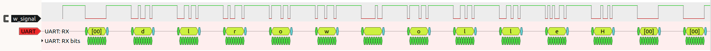

---

# UART Protocol

# Features
- Serial
- Full duplex
- Asynchronous
- No master or slave

# Popular uses
- For communication between microcontrollers
- For communication between microcontrollers and a computer (for debugging or sending commands)

# Interface

 

- 2 pins, Rx and Tx are used.
  - Rx : Read
  - Tx : Transmit
- A baud rate has to be set before-hand in both devices, because there is no clock signal.
- Standard baud rates are :
  - 9600, 19200, 38400, 57600, 115200, 230400, 460800, 921600, 1000000, 1500000
- Default voltage level (when inactive) is HIGH

# Protocol

- The UART packet looks like:

Source : Analog Devices [1] 

- A ```start bit``` indicates start of packet
  - The default ```HIGH``` level is pulled down to ```LOW``` for one clock cycle
  - The receiving UART detects the transition and prepares to read the subsequent bits

- The ```data frame``` holds the actual data. It can be 5 to 8 bits long if the parity bit is used, or 9 bits long if parity is not used.
  - LSB first

- ```Parity bit``` is used to check for errors. It can follow odd or even parity.

- ```Stop bit``` indicates end of packet
  - The signal is pulled ```HIGH``` for 1 to 2 cycles.

---

# Implementation

# Parameters

Parameter   | Function
:----------:|:---------:
p_CLK_DIV   | Clock division ratio
p_WORD_LEN  | Length of word transmitted (or received)

Note : The parity bit is included in the length. The controller must set the parity bit like a normal bit. The tx or rx circuits does not include the parity bit.

Calculate p_CLK_DIV as

``` p_CLK_DIV = (System clock speed) / (Baud rate) ```

# Interfaces

Note : prefix notation is in [README](../README.md)

For receiver, 

Name of port | Function
:-------------------:|:-----------:
i_clk                | High frequency clock
i_rx                 | UART Rx pin
o_receive_data       | Received data
o_receive_ready      | Is received data valid?

For transmitter,

Name of port | Function
:-----------:|:-----------:
i_clk        | High frequency system clock
i_send_en    | Enable send operation
i_send_data  | Data to be sent
o_tx         | UART Tx pin
o_send_rdy   | Is next data ready to be sent?

# State machines

Transmitter state machine | Receiver state machine
:-:|:-:
 | 

Created using draw.io

# Block diagram


---

# Result


Signal values :
- ```000``` : Idle
- ```001``` : Start bit
- ```010``` : Data bit
- ```011``` : Stop bit
- ```100``` : Restart stage

The output was tested with the string "Hello world" and analyzed using pulseview



---

# References

1) [Analog Devices](https://www.analog.com/en/analog-dialogue/articles/uart-a-hardware-communication-protocol.html#:~:text=By%20definition%2C%20UART%20is%20a,going%20to%20the%20receiving%20end.)
2) [NandLand implementation](https://www.nandland.com/vhdl/modules/module-uart-serial-port-rs232.html)

